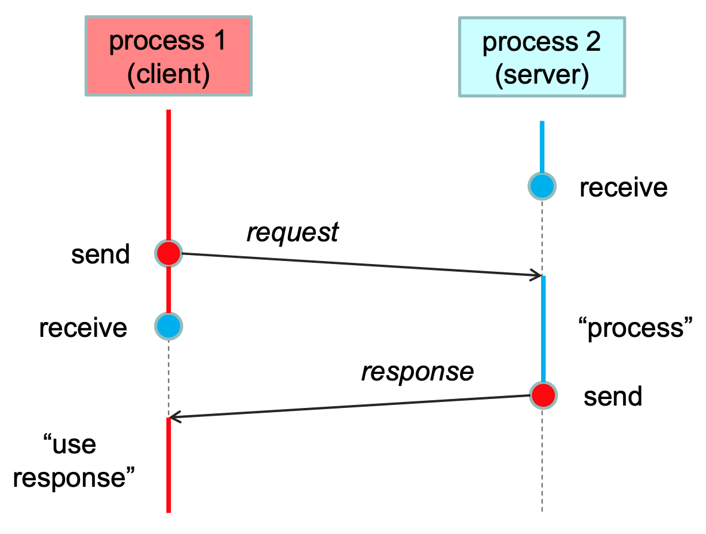
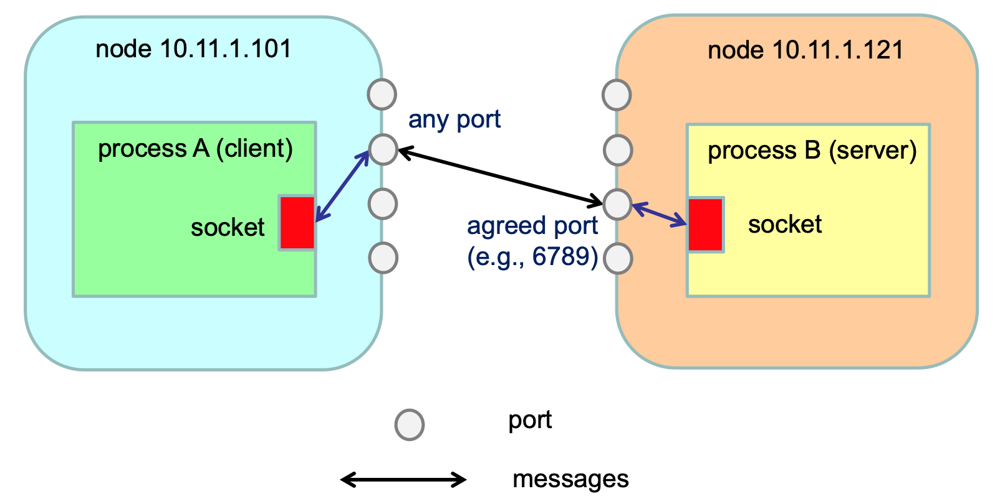

# 🧩 Progetto asw-815-connettori-distribuiti
Lo sviluppo dei **sistemi software distribuiti** richiede la realizzazione di **connettori** in grado di far interagire processi diversi.

---

## 🔗 Comunicazione interprocesso di base
In questa sezione viene trattata la **IPC unicast**:
- una coppia di processi indipendenti si scambiano sequenze di dati (*messaggi*) usando le primitive `send` e `receive`
- la comunicazione si basa su un **protocollo applicativo**, costituito da messaggi e regole condivise da entrambe le parti

### ✉️ Primitive
- **send** $\to$ consente ad un processo di trasmettere dati ad un altro processo
    - `send(receiving process, data)`
    - nella **comunicazione sincrona** è un'operazione **bloccante** (richiede conferma di ricezione per proseguire)
    - nella **comunicazione asincrona** è un'operazione **non bloccante** (utilizza un buffer per copiare il messaggio)
- **receive** $\to$ consente ad un processo di accettare dati trasmessi da un altro processo
    - `receive(sending process, *buffer)`
    - nella **comunicazione sincrona e asincrona** è un'operazione **bloccante**

Due ulteriori primitive per la *comunicazione connection-oriented*:
- **connect** $\to$ stabilisce una connessione logica tra due processi (alloca le risorse necessarie), si compone di:
    - `request-to-connect` + `accept-connection`
- **disconnect** $\to$ termina una connessione logica su entrambi i lati della comunicazione (dealloca le risorse)

### 🤝 Comunicazione client-server
Una modalità di comunicazione comune nei sistemi distribuiti è quella **client-server**, basata su un **protocollo richiesta-risposta** (si realizza una **sincronizzazione parziale** tra i due processi).

  

Il **protocollo** adottato specifica il **formato e** la **semantica dei messaggi** scambiati tra client e server.\
In particolare, definisce:
- il formato del messaggio di **richiesta** $\to$ rappresenta l’**invocazione dell’operazione** e **include i parametri** attuali;
- il formato del messaggio di **risposta** $\to$ rappresenta il **risultato dell’elaborazione**, oppure un’eccezione generata durante l’esecuzione.

Per garantire la corretta comunicazione, entrambe le parti devono concordare sul formato dei messaggi.
Ciascun lato è quindi responsabile delle operazioni di:
- **marshalling** $\to$ codifica dei dati e dei parametri in un formato trasmissibile;
- **unmarshalling** $\to$ decodifica dei dati ricevuti per ricostruire i valori originali.

---

## 🪝 Socket
I sistemi operativi offrono servizi di base per la **IPC** (*interprocess communication*).  
In questa sezione vengono analizzati i **socket**, un’astrazione di programmazione per lo **scambio di messaggi in rete** o tra processi locali.

I **socket** forniscono un **endpoint di comunicazione** e sono associati, a runtime, ad una **porta**.

    

