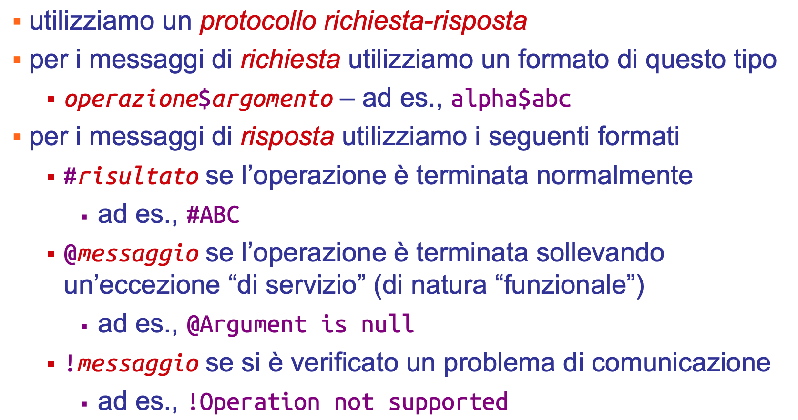
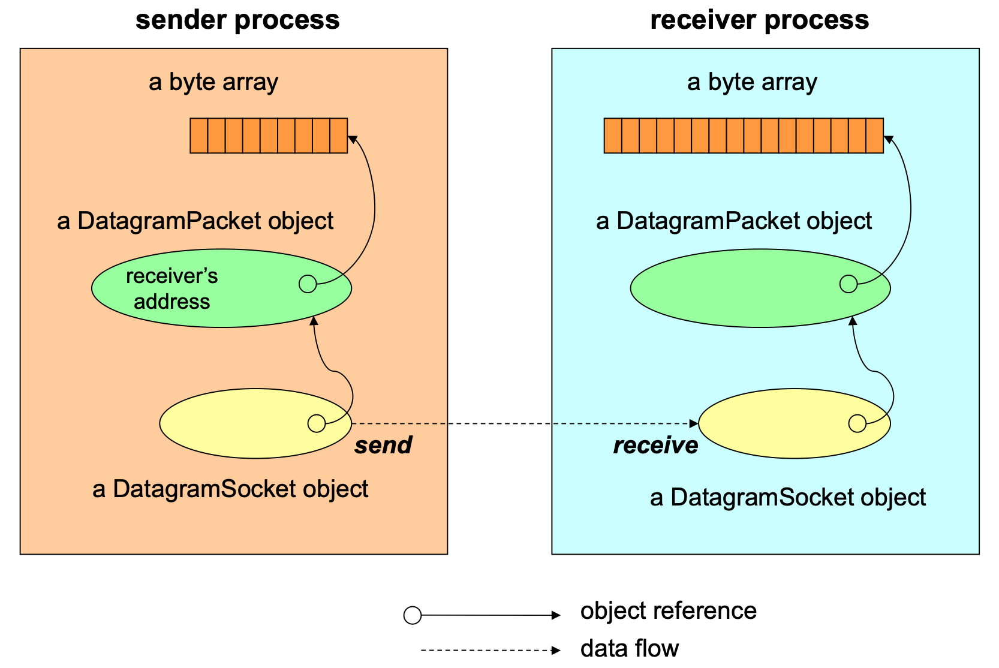
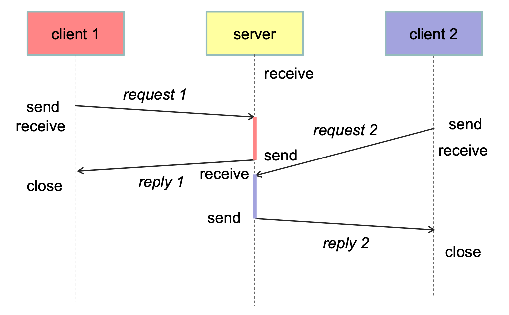
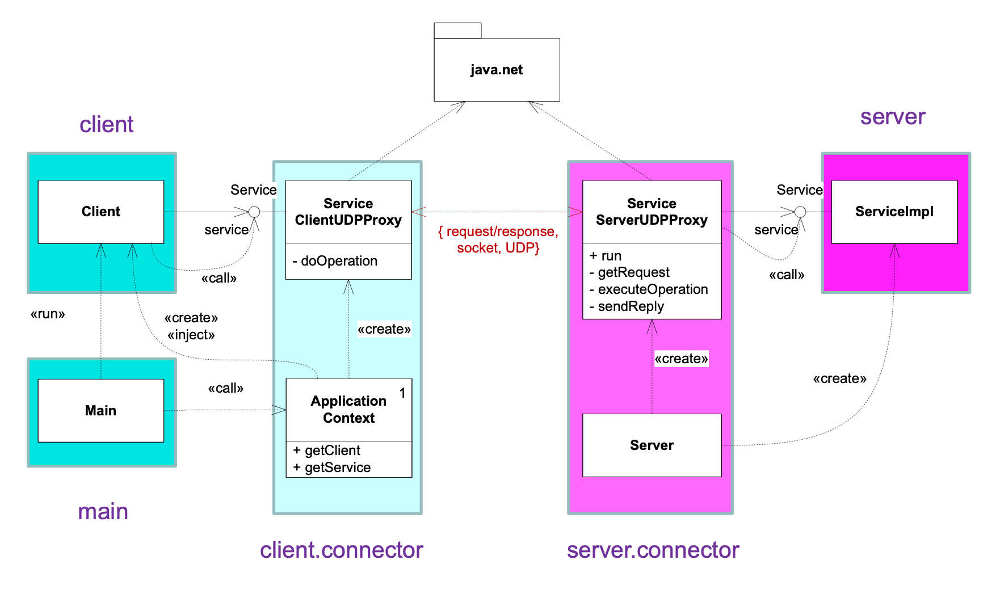

# 🧩 Progetto asw-815 versione a-client-server-udp
Questo progetto implementa un **servizio distribuito client-server** che comunica tramite **UDP**.
L’obiettivo è mostrare la struttura modulare di un sistema distribuito e l’**uso di proxy** per astrarre la comunicazione di rete.

---

## 📁 Struttura del progetto
```
a-client-server-udp
├── client/
│   └── src/main/java/asw/socket/client/
├── server/
│   └── src/main/java/asw/socket/server/
├── service/
│   └── src/main/java/asw/socket/service/
├── service-impl/
│   └── src/main/java/asw/socket/service/impl/
```
👉 Ciascun package corrisponde ad un ruolo:
- **client** $\to$ codice che effettua richieste
- **server** $\to$ codice che riceve e gestisce richieste
- **service** $\to$ definizione del contratto del servizio (interfacce + eccezioni)
- **service-impl** $\to$ implementazione concreta del servizio lato server

### 🖥️ Package `client`
**Componente di rete lato client**, invia richieste e riceve risposte tramite proxy.

Contiene:
- `Client.java` $\to$ programma principale del client
- `connector/ServiceClientUDPProxy.java` $\to$ connettore che invia richieste UDP al server e riceve le risposte
- `context/ApplicationContext.java` $\to$ gestore dell’inizializzazione dei componenti del client
- `main/Main.java` $\to$ punto di ingresso per eseguire il client

### 💻 Package `server`
**Componente di rete lato server**, gestisce richieste UDP ed invoca l'implementazione del servizio.

Contiene:
- `Server.java` $\to$ programma principale che avvia il server
- `connector/ServiceServerUDPProxy.java` $\to$ connettore che riceve i pacchetti UDP, traduce la comunicazione di rete in chiamate al servizio Java locale, e risponde al client

### 🧠 Package `service`
Queste classi vengono importate sia dal client che dal server. Servono per mantenere l’**indipendenza logica tra le due parti**, che condividono solo la definizione del servizio, non l’implementazione.

Contiene:
- `Service.java` $\to$ interfaccia del servizio (contratto condiviso da client e server)
- `ServiceException.java` $\to$ errore logico del servizio
- `RemoteException.java` $\to$ errore di comunicazione

### ⚙️ Package `service-imp`
Implementazione del servizio lato server, incapsula la **logica applicativa vera e propria**.

Contiene:
- `ServiceImpl.java` $\to$ implementazione effettiva dei metodi del servizio

## 🧱 Benefici di questa organizzazione
✅ **Modularità** – ogni parte ha un ruolo preciso\
✅ **Riutilizzabilità** – lo stesso servizio può essere usato con altri connettori\
✅ **Manutenibilità** – è facile cambiare l’implementazione del servizio o il protocollo di comunicazione\
✅ **Aderenza ai pattern architetturali**

---

## 🌐 Protocollo di comunicazione (UDP)


### 📡 Socket UDP
UDP consente la trasmissione di datagrammi tra due processi
- **comunicazione asincrona**
- essendo un protocollo **non affidabile**, richiede una gestione esplicita

<p align="center">
    
</p>

Architettura del server:
- l’operazione `receive` non specifica il mittente (**receive from any**)
- il **server** è di tipo **sequenziale** (un solo thread)
- server con **servizio stateless** $\to$ non deve gestire lo stato della conversazione con i suoi client

<p align="center">
    
</p>

---

## 🗺️ Diagramma UML delle classi

