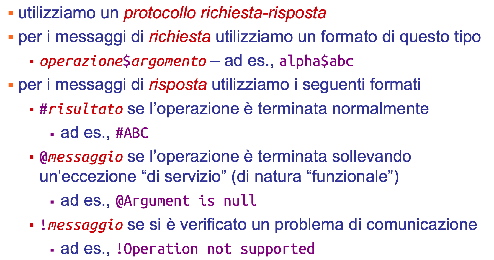
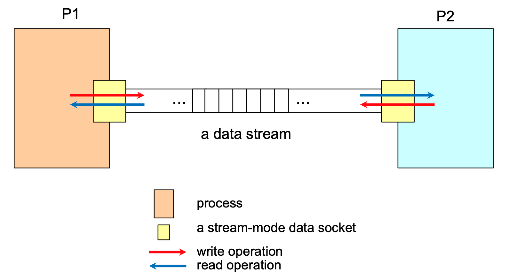
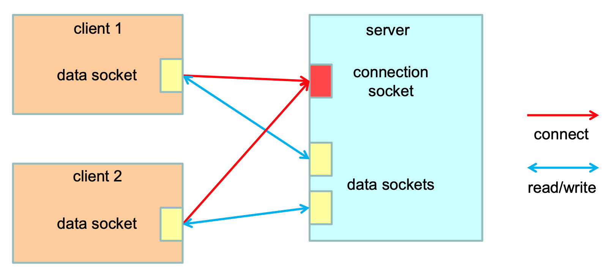
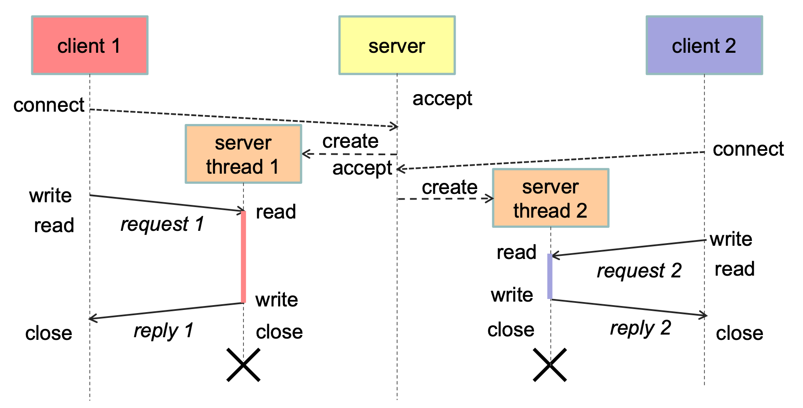
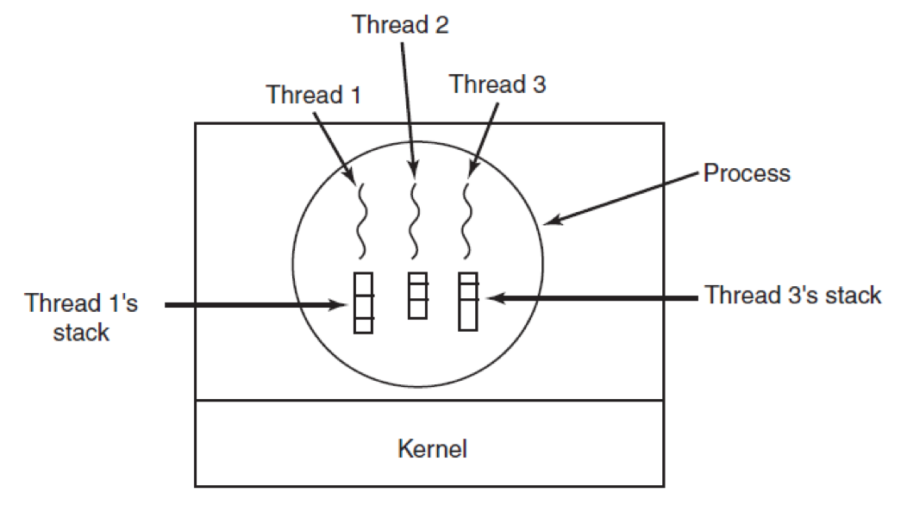
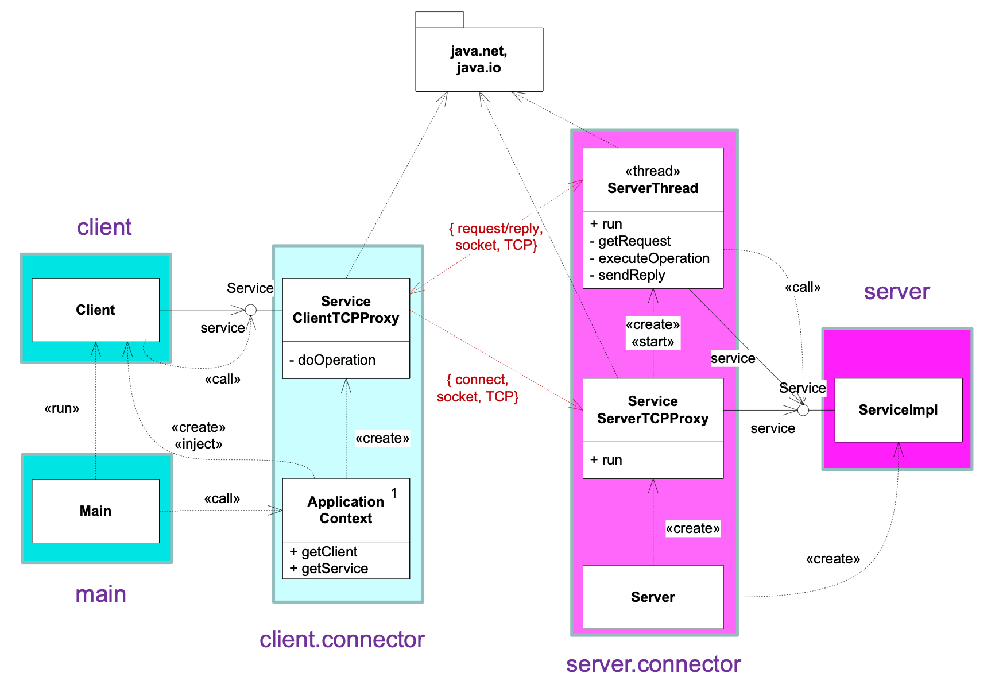

# 🧩 Progetto asw-815 versione b-client-server-tcp
Questo progetto implementa un **servizio distribuito client-server** che comunica tramite **TCP**.
L’obiettivo è mostrare la struttura modulare di un sistema distribuito e l’**uso di proxy** per astrarre la comunicazione di rete.

---

## 📁 Struttura del progetto
```
b-client-server-tcp
├── client/
│   └── src/main/java/asw/socket/client/
├── server/
│   └── src/main/java/asw/socket/server/
├── service/
│   └── src/main/java/asw/socket/service/
├── service-impl/
│   └── src/main/java/asw/socket/service/impl/
```
👉 Ciascun package corrisponde ad un ruolo:
- **client** $\to$ codice che effettua richieste
- **server** $\to$ codice che riceve e gestisce richieste
- **service** $\to$ definizione del contratto del servizio (interfacce + eccezioni)
- **service-impl** $\to$ implementazione concreta del servizio lato server

### 🖥️ Package `client`
**Componente di rete lato client**, invia richieste e riceve risposte tramite proxy.

Contiene:
- `Client.java` $\to$ programma principale del client
- `connector/ServiceClientTCPProxy.java` $\to$ connettore che gestisce la comunicazione TCP con il server, apre una connessione tramite socket
- `context/ApplicationContext.java` $\to$ gestore dell’inizializzazione dei componenti del client
- `main/Main.java` $\to$ punto di ingresso per eseguire il client

### 💻 Package `server`
**Componente di rete lato server**, gestisce richieste TCP ed invoca l'implementazione del servizio.

Contiene:
- `Server.java` $\to$ programma principale che avvia il server, apre una `ServerSocket` sulla porta specificata e rimane in attesa di connessioni dai client
- `connector/ServiceServerTCPProxy.java` $\to$ connettore che accetta le connessioni TCP, riceve le richieste dai client e gli assegna un thread
- `connector/ServerThread.java` $\to$ thread dedicato alla gestione di una singola connessione TCP

### 🧠 Package `service`
Queste classi vengono importate sia dal client che dal server. Servono per mantenere l’**indipendenza logica tra le due parti**, che condividono solo la definizione del servizio, non l’implementazione.

Contiene:
- `Service.java` $\to$ interfaccia del servizio (contratto condiviso da client e server)
- `ServiceException.java` $\to$ errore logico del servizio
- `RemoteException.java` $\to$ errore di comunicazione

### ⚙️ Package `service-imp`
Implementazione del servizio lato server, incapsula la **logica applicativa vera e propria**.

Contiene:
- `ServiceImpl.java` $\to$ implementazione effettiva dei metodi del servizio

---

## 🧱 Benefici di questa organizzazione
✅ **Modularità** – ogni parte ha un ruolo preciso\
✅ **Riutilizzabilità** – lo stesso servizio può essere usato con altri connettori\
✅ **Manutenibilità** – è facile cambiare l’implementazione del servizio o il protocollo di comunicazione\
✅ **Aderenza ai pattern architetturali**

---

## 🌐 Protocollo di comunicazione (TCP)


### 📡 Socket TCP
TCP consente la trasmissione di **flussi bidirezionali di dati** tra due processi.
- rispetto ad UDP, offre **maggiore affidabilità** (controllo sulla consegna e sull’ordine dei pacchetti)
- **comunicazione sincrona**

<p align="center">
    
</p>

Particolarità dell'API per TCP:
- il processo con **ruolo *client*** richiede la connessione tramite la primitiva `connect` $\to$ il processo con **ruolo *server*** risponde alla richiesta con la primitiva `accept` (bloccante)
- una volta stabilita la connessione, i due **processi peer** comunicano tramite primitive di `read` (bloccante) e `write` (non bloccante)
- sono definiti due tipi di socket:
    1. **server socket** $\to$ gestisce le richieste di connessione, **condiviso** tra tutti i client;
    2. **data socket** $\to$ usato per lo scambio di dati, **dedicato a un singolo** client.

<p align="center">
    
</p>

Architettura del server:
- il **server** è **concorrente** (multithreaded) $\to$ può gestire più client contemporaneamente
- se il **servizio** è **stateful**
    - ogni thread mantiene lo stato della conversazione con il proprio client
    - un server proxy condiviso può gestire lo stato applicativo globale

<p align="center">
    
</p>

### 👾 Processi e Thread
- **Thread** $\to$ uun’attività eseguibile, rappresentata da una sequenza di istruzioni, che può essere assegnata al processore
- **Processo** $\to$ un’istanza di programma in esecuzione, dotata delle proprie risorse
    - un processo può contenere **uno o più thread concorrenti**;
    - i thread **condividono risorse e spazio** di memoria (heap), ma non lo stack.

<p align="center">
    
</p>
---

## 🗺️ Diagramma UML delle classi

