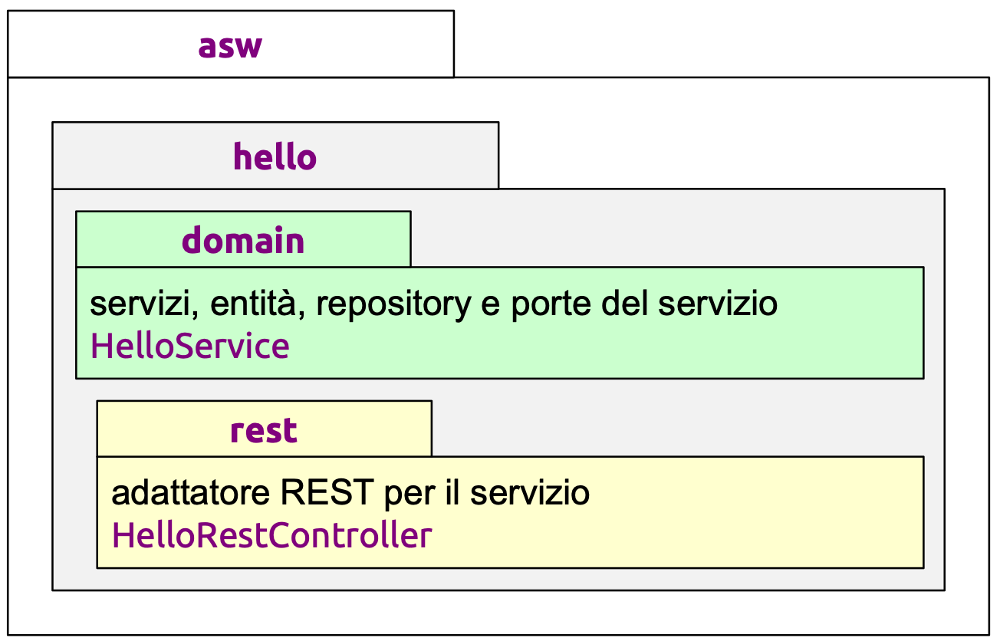
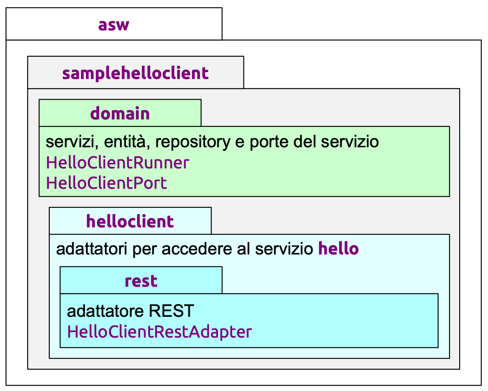

# 🧩 Progetto asw-835 versione a-hello
Questo progetto implementa un **servizio hello** per generare dei saluti.

---

## Servizio REST
L'interfaccia del servizio non deve essere definita in modo formale, ma va comunque stabilita ed identificata tramite annotazione `@Service`.\
**Per ogni operazione** del servizio va definita:
- **metodo** HTTP **e path**;
- **parametri con relativo tipo** (e se vengono scambiati nel path o nel corpo);
- **risultati con relativo tipo**.

Nel caso di `HelloService`, l'operazione `sayHello` è definita come:
- `GET /hello/{name}`;
- parametro `name` è una stringa, nel path;
- risultato è una stringa.

---

**Archiettura esagonale** del servizio:

    

### Server REST
Realizzato come un’applicazione Spring Boot.

La classe `HelloRestController` è il controller REST per il servizio ed è identificato da Spring attraverso l'annotazione **`@RestController`**. Funge da **inbound adapter** lato server:
- **interpreta le richieste** REST del client **e le traduce** in richieste adatte all'oggetto (servizio helloService);
- **riceve le risposte** dal servizio **e le traduce** in risposte per il client.

Il metodo `sayHello` realizza il collegamento tra controller e servizio:
- specifica come catturare l’invocazione – mediante annotazione `@GetMapping`;
- estrae i parametri dell’invocazione – mediante annotazione `@PathVariable`;
- invoca l’operazione richiesta del servizio ed ottiene il risultato;
- restituisce un **risultato**, **trasmesso da Spring** al client.

### Client REST
Realizzato come un’applicazione Spring Boot.

Nel dominio, viene definita l'**interfaccia richiesta** `HelloClientPort` (una **porta**) **per accedere al servizio**.

È richiesto un **outbound adapter** REST **`HelloClientRestAdapter`**, **per accedere al servizio**:
- **interpreta le richieste della logica di buisness** tramite una porta inbound **e le traduce** in una forma adatta all’entità esterna;
- **ottiene le risposte dall'entità esterna e le traduce** in una forma adatta alla logica di buisness.

---

**Archiettura esagonale** del client:

    

