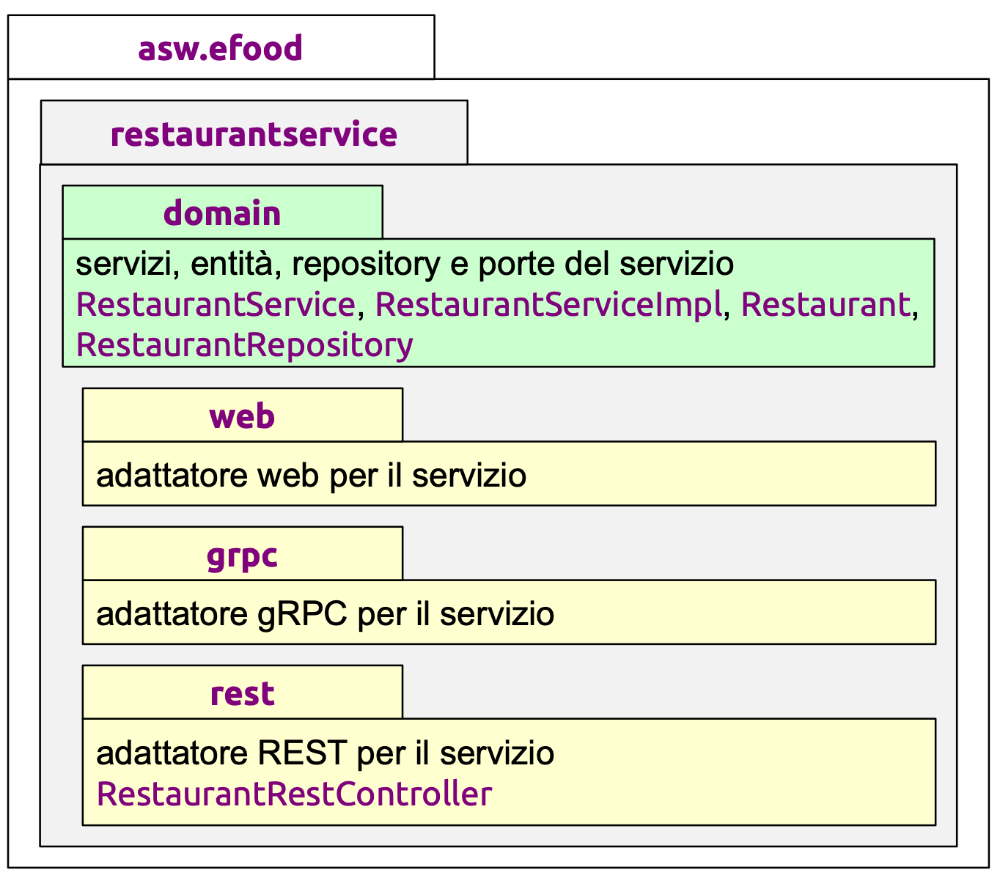
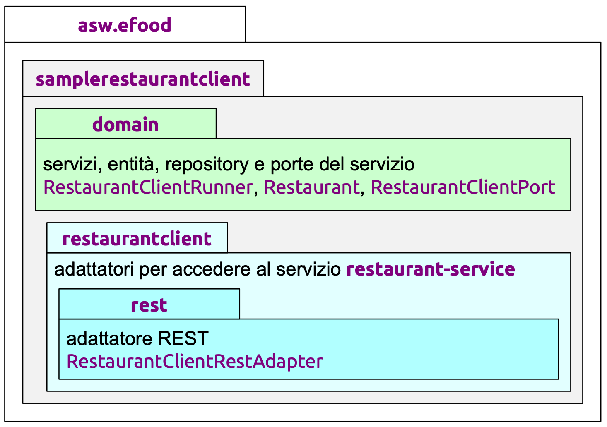

# 🧩 Progetto asw-835 versione b-restaurants
Questo progetto implementa un **servizio** per la gestione di un insieme di ristoranti.\
Tale servizio opera nell'ambito di un'applicazione di efood per la gestione di un servizio di ordinazione e spedizione a domicilio, su scala nazionale.

---

## Package service-api
Il package **contiene le strutture di dati richieste dall’interfaccia del servizio** ed è **condiviso tra server e client**.

### Presentation Model
Per ciascuna operazione POST, vengono create due classi: `...Request`; `...Response`.\
Per ciascuna operazione GET (su una singola entità), viene creata una solla classe `...Response`.

---

**Archiettura esagonale** del servizio:

    

**Archiettura esagonale** del client:

    

